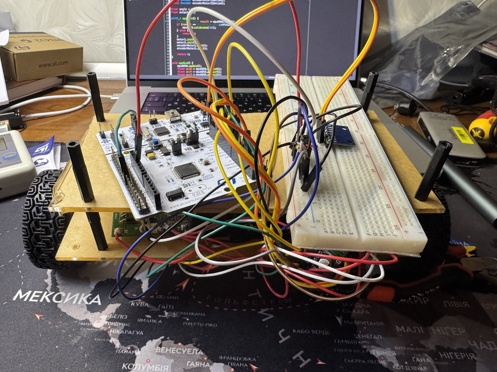

# stm32-self-balancing-robot
 
Self-balancing two-wheeled robot on **STM32 Nucleo-F446RE**, built as an embedded engineering portfolio project.
 

 
## Status
 
The project is currently **on hold** due to a hardware failure (third NUCLEO board damaged by a wiring short on breadboard). Software architecture and control logic are implemented and tested individually; full closed-loop balancing was not reached before the hardware incident.
 
## What works
 
- **MPU-6050 IMU driver** — custom I2C driver with calibration and raw sensor reading (`App/imu/`)
- **Kalman filter** for pitch angle estimation from accelerometer + gyroscope data
- **PID controller** for angle stabilization (`App/control/`)
- **Motor control** — PWM-based dual H-bridge control via DRV8871, with direction inversion for mirrored motor mounting
- **Quadrature encoder reading** (`App/motors/Encoder.hpp`)
- **500Hz control loop** driven by hardware timer interrupt (TIM2), decoupled from `HAL_GetTick()` for deterministic `dt`
- **UART telemetry** — real-time angle/output streaming for tuning and debugging
- **Safety fallback** — motors cut off if tilt angle exceeds a configurable threshold
## What's not finished
 
- PID gains were not fully tuned — robot reacts to tilt but does not yet balance autonomously
- IMU mounting orientation needs to be finalized (currently breadboard-mounted, not rigidly fixed to the chassis)
- Encoder-based velocity feedback (cascaded control loop) not yet integrated into the control loop
## Hardware
 
| Component | Detail |
|---|---|
| Main MCU | NUCLEO-F446RE (Cortex-M4, 180 MHz) |
| IMU | MPU-6050 |
| Motors | 2× DC motor with quadrature encoder, 170 RPM, 12V |
| Motor driver | DRV8871 |
| Power | 3× 18650 Li-ion (~11.1V), BMS HW-380 |
 
## Lessons learned
 
This project went through **three damaged NUCLEO boards**, all from the same root cause: short circuits on a breadboard with a large number of loose jumper wires. The fix isn't a knowledge gap — proper practice (common ground verification, schematic-on-paper before powering, multimeter continuity checks) was known and documented, but easy to skip under the pressure of "just testing one more thing."
 
Next hardware iteration will move away from breadboard jumper wires toward soldered/fixed connections (perfboard or PCB) to remove this failure mode structurally rather than relying on discipline alone.
 
## Software architecture
 
```
F446RE/
├── App/
│   ├── app.hpp / app.cpp       — main control loop
│   ├── robot_config.hpp        — tuning constants
│   ├── motors/
│   │   ├── Encoder.hpp
│   │   └── MotorController.hpp
│   ├── imu/
│   │   └── MPU-6050.hpp/.cpp
│   ├── filters/
│   │   └── KalmanFilter.hpp/.cpp
│   └── control/
│       └── PIDController.hpp/.cpp
```
 
C++17, no heap allocation, no exceptions/RTTI (`-fno-exceptions -fno-rtti`).
